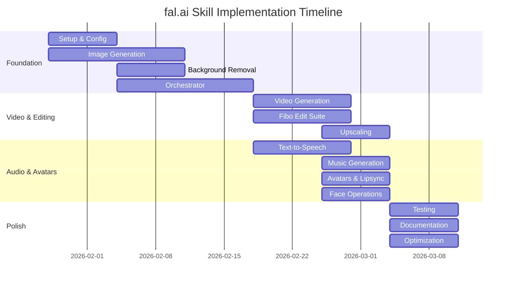

# fal.ai Skill Implementation Roadmap

## Executive Summary

**Vision**: Comprehensive Claude Code skill supporting 1,000+ fal.ai models across 12 AI generation categories.

**Timeline**: 6 weeks full-time (10-12 weeks part-time)
**Scope**: 12 categories, 1,000+ models (excluding 3D and training)
**Architecture**: Layered intelligent orchestration with self-learning

---

## Release Milestones

### 🎯 Milestone 1: MVP Foundation (Week 1-3)
**Release**: Alpha v0.1
**Goal**: Core image generation with intelligent orchestration

**Deliverables**:
- ✅ `/fal-setup` - Configuration & API key management
- ✅ `/fal-generate-image` - Text-to-image (3 models)
- ✅ `/fal-remove-bg` - Background removal
- ✅ `/fal-generate` - Smart orchestrator with intent detection
- ✅ Response Adapter with self-learning
- ✅ Model registry (5 core models)

**Success Metrics**:
- User can generate images in <5 minutes from setup
- Intent detection accuracy ≥85%
- Response Adapter learns successful paths

**Target Users**: Early adopters, image generation use cases

---

### 🎬 Milestone 2: Video & Advanced Editing (Week 4-5)
**Release**: Beta v0.5
**Goal**: Video generation and advanced image editing

**Deliverables**:
- ✅ `/fal-generate-video` - Kling video series (23 models)
- ✅ `/fal-edit-photo` - Fibo Edit suite (10+ operations)
  - Colorize, relight, reseason, restore, restyle
  - Add/erase/replace objects by text
- ✅ `/fal-upscale` - Image/video upscaling
- ✅ Expanded model registry (50+ models)

**Success Metrics**:
- Video generation <60s for standard requests
- Fibo Edit operations work correctly
- Cost warnings display for premium operations

**Target Users**: Content creators, video producers, designers

---

### 🎵 Milestone 3: Audio & Avatars (Week 4-5)
**Release**: Beta v0.7
**Goal**: Audio generation and interactive avatars

**Deliverables**:
- ✅ `/fal-generate-audio` - TTS (40 models, multi-language)
- ✅ `/fal-generate-music` - Music & sound effects (62 models)
- ✅ `/fal-avatar` - Lipsync avatars (29 models)
- ✅ `/fal-face` - Face operations (17 models)
- ✅ `/fal-transcribe` - Speech-to-text (12 models)

**Success Metrics**:
- TTS generates audio in 9+ languages
- Avatar lipsync matches audio accurately
- Face swap works for images & video

**Target Users**: Podcasters, video creators, music producers

---

### 🚀 Milestone 4: Production Release (Week 6)
**Release**: v1.0
**Goal**: Production-ready with comprehensive testing

**Deliverables**:
- ✅ Comprehensive test suite (>80% coverage)
- ✅ Performance optimization (<1s startup)
- ✅ Complete documentation
- ✅ Troubleshooting guides
- ✅ Workflow examples

**Success Metrics**:
- All tests pass
- Performance targets met
- Documentation complete

**Target Users**: General availability

---

## Feature Roadmap



---

## Category Rollout Plan

### Phase 1: Visual Foundation (Week 1-3)
**Status**: 🔵 Core MVP

| Category | Models | Priority | Complexity |
|----------|--------|----------|------------|
| **textToImage** | 150 | P0 | Low |
| **backgroundRemoval** | 36 | P0 | Low |
| **Orchestrator** | - | P0 | Medium |

**Why First?**
- Fastest time-to-value
- Simple API patterns to establish foundation
- High user demand

---

### Phase 2: Video & Advanced Editing (Week 4-5)
**Status**: 🟢 In Progress

| Category | Models | Priority | Complexity |
|----------|--------|----------|------------|
| **textToVideo** | 103 | P1 | Medium |
| **imageToVideo** | 152 | P1 | Medium |
| **imageToImage** | 349 | P1 | High |
| **upscale** | 19 | P2 | Low |

**Why Second?**
- Builds on image foundation
- Video demand growing rapidly
- Fibo Edit suite provides advanced editing capabilities

**Notable Models**:
- Kling (O1, 1.5-2.6): 23 variants
- Fibo Edit: 10+ specialized operations

---

### Phase 3: Audio & Interaction (Week 4-5)
**Status**: 🟢 In Progress

| Category | Models | Priority | Complexity |
|----------|--------|----------|------------|
| **tts** | 40 | P1 | Low |
| **musicAudio** | 62 | P2 | Medium |
| **lipsyncAvatar** | 29 | P2 | High |
| **face** | 17 | P2 | Medium |
| **asr** | 12 | P3 | Low |

**Why Third?**
- Audio complements video capabilities
- Avatar use cases growing
- Multi-language TTS high demand

**Notable Models**:
- ElevenLabs: turbo-v2.5, eleven-v3, multilingual-v2
- Kokoro: 9 language variants
- Kling AI Avatar v2

---

### Phase 4: Enhancement & Misc (Week 4-5)
**Status**: 🟡 Planned

| Category | Models | Priority | Complexity |
|----------|--------|----------|------------|
| **videoToVideo** | 129 | P3 | Medium |
| **audioToAudio** | 17 | P3 | Medium |
| **videoToAudio** | 4 | P3 | Low |

**Why Last?**
- Nice-to-have features
- Lower immediate demand
- Completes the offering

---

### Out of Scope (Initial Release)
**Status**: ⚫ Deferred

| Category | Models | Reason |
|----------|--------|--------|
| ~~**threeD**~~ | 35 | Niche use case, high complexity |
| ~~**training**~~ | 34 | Advanced users, requires separate workflow |

**Future Consideration**: May revisit in v2.0 based on user feedback

---

## Technical Architecture Evolution

### Week 1-2: Foundation Layer
```
┌─────────────────────────────────────┐
│         /fal-setup                  │ ← API key management
├─────────────────────────────────────┤
│    Response Adapter (self-learning) │ ← Adaptive field extraction
├─────────────────────────────────────┤
│       Model Registry (YAML)         │ ← 5 core models
├─────────────────────────────────────┤
│     Python API Client (stdlib)      │ ← HTTP wrapper
└─────────────────────────────────────┘
```

### Week 3: Intelligence Layer
```
┌─────────────────────────────────────┐
│         /fal-generate               │ ← Universal entry point
│    (Intent Detection + Routing)    │
├─────────────────────────────────────┤
│  Session Context (last 5 ops)      │ ← Pronoun resolution
├─────────────────────────────────────┤
│  Prompt Engineering Templates      │ ← Model-specific optimization
└─────────────────────────────────────┘
```

### Week 4-5: Specialized Skills
```
┌─────────────────────────────────────┐
│        /fal-generate                │ ← Orchestrator
├──────────┬──────────┬───────────────┤
│  Image   │  Video   │  Audio        │
│  Skills  │  Skills  │  Skills       │
├──────────┼──────────┼───────────────┤
│ generate │ generate │ tts           │
│ remove-bg│ edit     │ music         │
│ edit     │ upscale  │ transcribe    │
│ upscale  │          │               │
├──────────┴──────────┴───────────────┤
│  Avatar  │  Face    │  Registry     │
│  Skills  │  Skills  │  (50+ models) │
└─────────────────────────────────────┘
```

---

## Model Registry Growth

### Registry Evolution

| Week | Models | Categories | Notable Additions |
|------|--------|------------|-------------------|
| **Week 1** | 5 | 2 | flux-pro, flux-dev, z-image/base, birefnet |
| **Week 2** | 10 | 3 | kling-v1, more Flux variants |
| **Week 3** | 15 | 4 | orchestrator routing complete |
| **Week 4** | 35 | 8 | Kling series (23), Fibo Edit (10), ElevenLabs |
| **Week 5** | 50+ | 12 | Music, avatars, face, all categories |
| **Week 6** | 50+ | 12 | Testing & optimization |

### Target Registry Coverage (v1.0)

**Core Models by Category** (curated selection of 50-100 models from 1,109):

```yaml
# Week 1-3 (MVP)
textToImage: [flux-pro, flux-dev, z-image/base, aura-flow, bagel]
backgroundRemoval: [birefnet-v2, bria-rmbg-2.0]

# Week 4 (Video & Editing)
textToVideo: [kling-2.6-pro, seedance-1.5, animatediff]
imageToVideo: [kling-2.6-pro, kling-o1, kling-1.5-pro]
imageToImage: [
  fibo-edit-colorize,
  fibo-edit-relight,
  fibo-edit-reseason,
  fibo-edit-restyle,
  fibo-edit-restore,
  inpaint-base,
  outpaint-base
]
upscale: [crystal-upscaler, clarity-upscaler, esrgan]

# Week 5 (Audio & Avatars)
tts: [
  elevenlabs-turbo-v2.5,
  elevenlabs-eleven-v3,
  elevenlabs-multilingual-v2,
  kokoro-american,
  kokoro-british,
  chatterbox
]
musicAudio: [beatoven-music, cassetteai-music, cassetteai-sfx]
lipsyncAvatar: [kling-ai-avatar-v2-pro, argil-avatars, live-portrait]
face: [face-swap-image, face-swap-video, face-to-sticker, headshot-generator]
asr: [whisper-large-v3]

# Week 5 (Enhancement)
videoToVideo: [style-transfer, video-enhance]
audioToAudio: [voice-clone]
```

---

## Success Metrics by Milestone

### Milestone 1 (Week 1-3) - MVP
- [ ] Setup time: <5 minutes from install to first generation
- [ ] Image generation success rate: >85%
- [ ] Intent detection accuracy: ≥85%
- [ ] Response Adapter learns paths: 3 successes per model
- [ ] User satisfaction: "Easy to use" feedback

### Milestone 2 (Week 4-5) - Video & Editing
- [ ] Video generation time: <60s for standard (5s video)
- [ ] Fibo Edit operations work: 10/10 operations functional
- [ ] Upscaling quality: Noticeable improvement
- [ ] Cost warnings: Display before expensive operations
- [ ] User workflows documented: ≥3 common pipelines

### Milestone 3 (Week 4-5) - Audio & Avatars
- [ ] TTS latency: <10s for 30s audio
- [ ] TTS language support: 9+ languages working
- [ ] Avatar lipsync accuracy: Visually convincing
- [ ] Face swap quality: Natural-looking results
- [ ] Music generation quality: Usable for content

### Milestone 4 (Week 6) - Production
- [ ] Test coverage: >80% for core modules
- [ ] Performance: Startup time <1s
- [ ] Documentation: Complete user & contributor guides
- [ ] Error handling: Graceful failures with actionable messages
- [ ] Model registry: 50+ models tested and working

---

## Resource Requirements

### Development Time

**Full-Time Development** (40 hrs/week):
- Week 1: 40 hrs - Foundation & setup
- Week 2: 40 hrs - Image generation & basic orchestration
- Week 3: 40 hrs - Intelligence layer & routing
- Week 4: 40 hrs - Video, editing, audio skills
- Week 5: 40 hrs - Avatars, face, complete all skills
- Week 6: 40 hrs - Testing, docs, optimization
- **Total**: 240 hours (6 weeks)

**Part-Time Development** (20 hrs/week):
- **Total**: 240 hours (12 weeks)

### Infrastructure

**Development**:
- Python 3.8+ environment
- fal.ai API account with credits
- Git repository
- Text editor / IDE

**Testing**:
- fal.ai API credits: ~$50-100 for comprehensive testing
- Test data: sample images, audio, videos
- Multiple model tests per category

**Documentation**:
- Markdown files
- Screenshot/video capture tools for examples
- Workflow diagrams (Mermaid)

---

## Risk Management

### High Priority Risks

| Risk | Impact | Mitigation | Owner |
|------|--------|------------|-------|
| **Response format variation** | High | Self-learning Response Adapter with 15+ patterns | Dev |
| **API changes break integration** | High | Version API calls, monitor changelog, flexible adapter | Dev |
| **Cost overruns during testing** | Medium | Use budget models for tests, cache results | Dev |
| **Intent detection accuracy** | Medium | Multi-stage detection, confidence thresholds, user feedback | Dev |

### Medium Priority Risks

| Risk | Impact | Mitigation | Owner |
|------|--------|------------|-------|
| **Fibo Edit complexity** | Medium | Start with 3-5 operations, expand gradually | Dev |
| **Avatar lipsync quality** | Medium | Test multiple models, document quality differences | Dev |
| **Multi-language TTS accuracy** | Low | Use established models (ElevenLabs, Kokoro) | Dev |

---

## Dependencies & Blockers

### External Dependencies

- ✅ fal.ai API availability
- ✅ Python 3.8+ on user system
- ✅ Internet connection for API calls
- ✅ User has fal.ai API key

### Internal Dependencies

- ✅ Claude Code skill loading mechanism
- ✅ Bash tool availability
- ✅ File system access (~/.config/)

### Critical Path

```
Week 1: Setup → Response Adapter → Model Registry
         ↓
Week 2: Image Skills → Background Removal
         ↓
Week 3: Orchestrator → Intent Detection → Session Context
         ↓
Week 4-5: Video Skills → Audio Skills → Avatar Skills
         ↓
Week 6: Testing → Documentation → Release
```

**Blockers**: None currently identified. All dependencies available.

---

## Post-Launch Roadmap (v1.1 - v2.0)

### v1.1 - Community Contributions (Week 8-10)
- User-contributed model definitions
- Prompt template library
- Workflow marketplace

### v1.2 - Advanced Features (Week 12-16)
- Batch processing support
- Multi-step pipeline automation
- Cost tracking & budgeting
- Model comparison tool

### v1.5 - Integration Enhancements (Week 18-24)
- Export to project files
- History tracking & regeneration
- Favorites/bookmarks system
- Team sharing capabilities

### v2.0 - Advanced Capabilities (Week 26-40)
- 3D generation support (35 models)
- Model training workflows (34 models)
- Enterprise features
- API rate optimization
- Advanced caching strategies

---

## Communication Plan

### Stakeholder Updates

**Weekly Status Updates**:
- Milestone progress
- Completed features
- Blockers/risks
- Next week priorities

**Milestone Demos**:
- End of Week 3: MVP demo (image generation)
- End of Week 5: Full feature demo (all categories)
- End of Week 6: Production release

### Documentation Timeline

| Week | Documentation | Status |
|------|--------------|--------|
| 1-3 | README, Quick Start, SKILL.md files | ✅ MVP |
| 4-5 | Workflow guides, Fibo Edit guide, Multi-lang TTS | 🟢 In Progress |
| 6 | Complete docs, troubleshooting, contributing | 🟡 Planned |

---

## Go/No-Go Criteria

### Milestone 1 (MVP) - Go/No-Go Decision Point

**Go Criteria** (must have all):
- ✅ `/fal-setup` working with API key validation
- ✅ At least 1 image generation model working end-to-end
- ✅ Response Adapter successfully extracts results
- ✅ Basic intent detection functioning
- ✅ No critical security issues

**No-Go Criteria** (any of these):
- ❌ Cannot connect to fal.ai API reliably
- ❌ Response Adapter fails >50% of the time
- ❌ Setup time exceeds 15 minutes
- ❌ Security vulnerabilities identified

### Milestone 2 (Video & Editing) - Go/No-Go Decision Point

**Go Criteria**:
- ✅ Video generation produces valid MP4 files
- ✅ At least 5 Fibo Edit operations working
- ✅ Upscaling shows quality improvement
- ✅ Cost warnings display correctly

### Milestone 4 (Production) - Go/No-Go Decision Point

**Go Criteria**:
- ✅ All test suites passing (>80% coverage)
- ✅ Performance targets met (<1s startup, <30s image, <60s video)
- ✅ Documentation complete and reviewed
- ✅ No P0/P1 bugs remaining
- ✅ User acceptance testing completed

---

## Appendix

### Model Count by Category (Full Breakdown)

From `/Users/cheng/InfQuest/InfProj/remotion-copy/src/api/fal-models.json`:

| Category | Count | In Scope | Priority |
|----------|-------|----------|----------|
| imageToImage | 349 | ✅ Yes | P1 |
| textToImage | 150 | ✅ Yes | P0 |
| imageToVideo | 152 | ✅ Yes | P1 |
| videoToVideo | 129 | ✅ Yes | P3 |
| textToVideo | 103 | ✅ Yes | P1 |
| musicAudio | 62 | ✅ Yes | P2 |
| tts | 40 | ✅ Yes | P1 |
| backgroundRemoval | 36 | ✅ Yes | P0 |
| threeD | 35 | ❌ No | - |
| training | 34 | ❌ No | - |
| lipsyncAvatar | 29 | ✅ Yes | P2 |
| upscale | 19 | ✅ Yes | P2 |
| audioToAudio | 17 | ✅ Yes | P3 |
| face | 17 | ✅ Yes | P2 |
| asr | 12 | ✅ Yes | P3 |
| videoToAudio | 4 | ✅ Yes | P3 |

**Total in Scope**: 1,040 models across 12 categories

### Key References

**Architecture Documentation**:
- Main plan: `docs/plans/2026-01-28-feat-fal-ai-multi-capability-skill-plan.md`
- Brainstorm: `brainstorm/ARCHITECTURE-SUMMARY.md`
- Detailed design: `brainstorm/2026-01-28-fal-skill-architecture-brainstorm.md`

**Model Catalog**:
- Source: `/Users/cheng/InfQuest/InfProj/remotion-copy/src/api/fal-models.json`
- Last updated: 2026-01-27
- Total models: 1,109

**Reference Skills**:
- Complex API: `~/.agents/skills/last30days/SKILL.md`
- CLI wrapper: `~/.config/opencode/skills/better-icons/SKILL.md`

---

**Roadmap Status**: ✅ Ready for execution
**Next Step**: Begin Week 1 implementation - Foundation setup
**Estimated Completion**: 2026-03-11 (6 weeks from 2026-01-28)